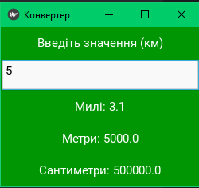

# Distance Converter
A simple distance converter from kilometers to miles, meters, and centimeters using the Kivy library.


## Getting Started:

1. **Git clone**
   Завантажити репозиторій за допомогою git:
   ```bash
   git clone https://github.com/VladSkopenko/Kivy_Converter
2. **Install requirements:**
   Завантажити залежності за допомогою pip:
   ```bash
   pip install -r requirements.txt
3. **Python main.py**
   Запустити застосунок за допомогою python:
   ```bash
   py main.py